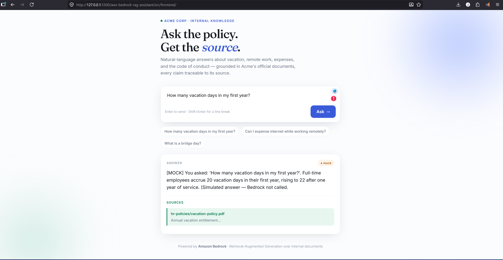
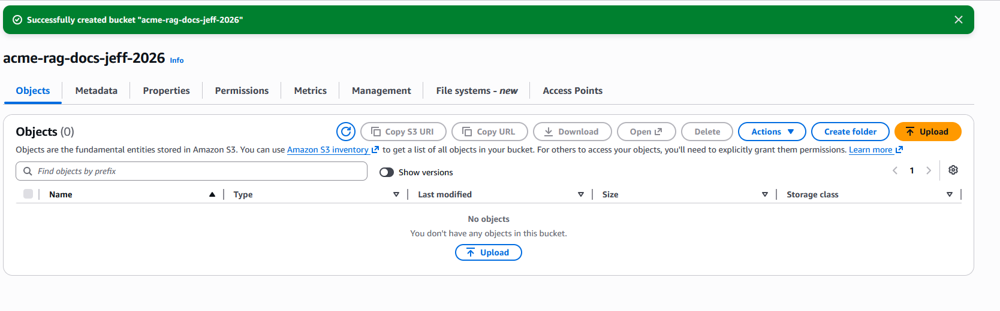
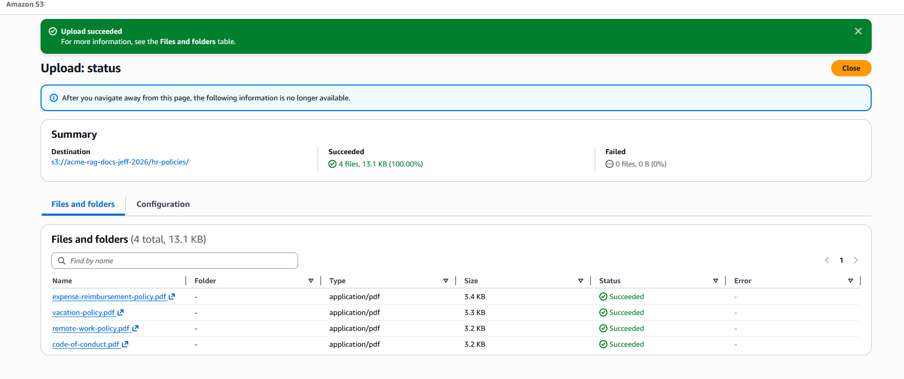
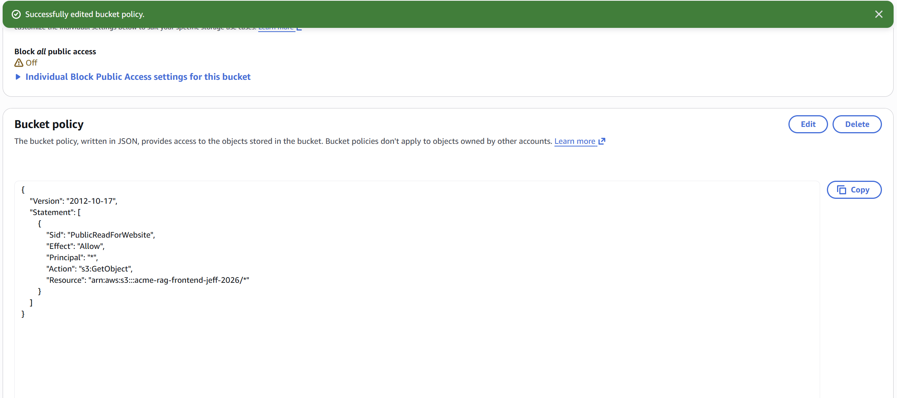
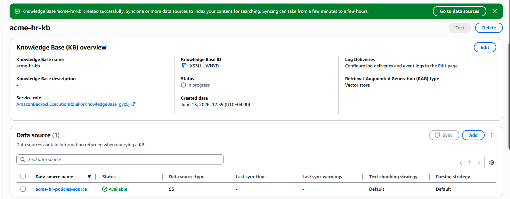
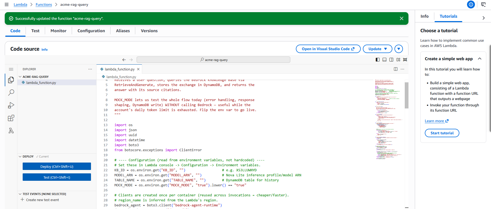
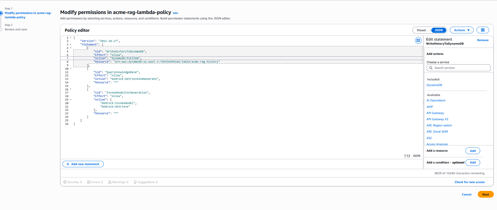
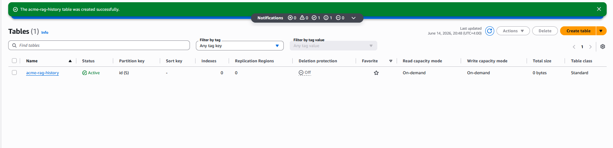
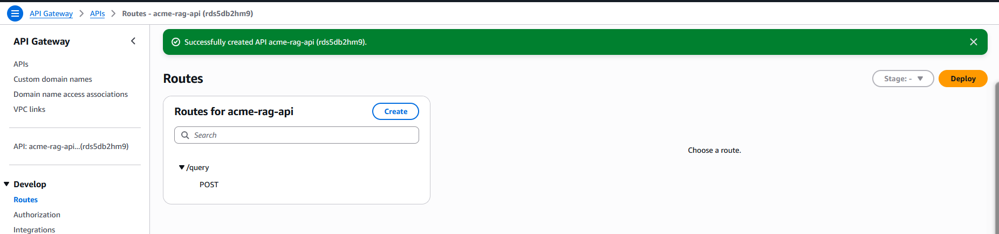
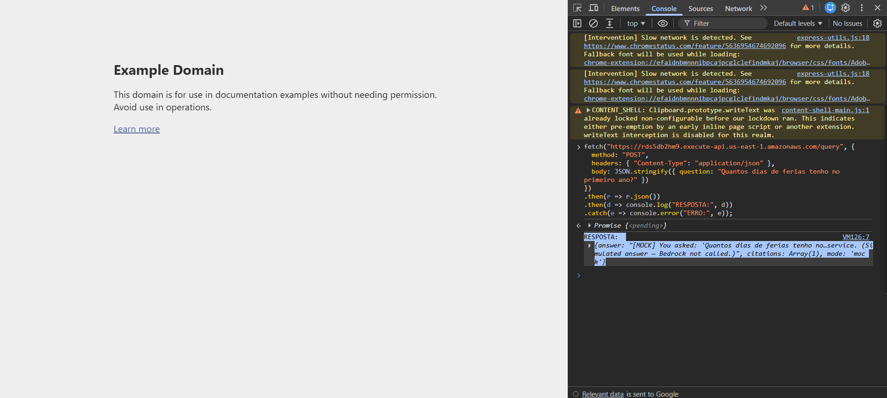

# 🤖 AWS Bedrock RAG Assistant

> Enterprise knowledge assistant using **Retrieval-Augmented Generation (RAG)** on AWS — fully serverless, built with cost governance and Responsible AI from day one.

[-success)](#-live-demo)

---

## 🚀 Live demo

**[Try it live →](http://acme-rag-frontend-jeff-2026.s3-website-us-east-1.amazonaws.com)** — a fully functional end-to-end UI (front-end → API Gateway → Lambda → response). It currently returns **simulated answers with static citations** while the real RAG pipeline awaits account quota; see the note below.

> **Currently running in mock mode** while the account-level Amazon Bedrock token quota is being provisioned (a known limitation on new accounts — AWS Support case open). The full RAG pipeline is built and wired end to end: S3 → Bedrock Knowledge Base → Titan embeddings → S3 Vectors → Lambda → API Gateway → front-end. Switching from simulated to live answers is a single environment-variable change (`MOCK_MODE=false`).

---

## 📋 About the project

**Acme RAG Assistant** is a web application where employees ask questions in natural language and receive answers **grounded in the company's internal documents** (HR policies), with source citations. The goal is not the app itself — it is to demonstrate a **professional GenAI architecture**: managed RAG with Amazon Bedrock Knowledge Bases, low-cost vector storage with Amazon S3 Vectors, and strict cost governance. Runtime safety with Bedrock Guardrails is designed and planned (see [Roadmap](#-roadmap--not-yet-built)).

### 🎯 Simulated business problem

Acme Corp's HR team answers the same policy questions every day. The documents exist, but keyword search fails whenever employees phrase questions differently from the documents' wording. The company needs **grounded, citable answers at near-zero cost** before investing in a full internal tool.

### 🛠️ Technologies and services

**Cloud (AWS):** Amazon Bedrock (Knowledge Bases · Guardrails *planned*) · Amazon S3 · Amazon S3 Vectors · AWS Lambda · Amazon API Gateway · Amazon DynamoDB · AWS IAM · Amazon CloudWatch · AWS CloudTrail · AWS Budgets

**Application:** Python 3.14 · boto3 · HTML5 · CSS3 · JavaScript (vanilla)

**Tooling:** Bash · Git · Mermaid · draw.io

---

## 🏛️ Architecture

📄 Full diagram and request flow in [docs/architecture.md](docs/architecture.md) · Every design choice justified in [docs/decision-log.md](docs/decision-log.md)

- **Ingestion path:** documents stored in S3 (SSE-S3 encryption, versioning, Block Public Access) → Bedrock Knowledge Base → Titan Text Embeddings → S3 Vectors index
- **Query path:** static web front-end → API Gateway → Lambda (Python) → Bedrock `RetrieveAndGenerate` (Amazon Nova Lite) → answer **with source citations** *(Guardrails to be inserted at this step — planned)*
- **State:** DynamoDB stores question history
- **Observability:** CloudWatch logs and metrics · CloudTrail audit trail
- **Cost governance:** AWS Budgets (USD 5 cap, layered alerts at 50/80/100%) · cost-allocation tags on every resource

---

## 💰 Cost estimate

| Service | Pricing model | Free Tier? | Project estimate |
|---|---|---|---|
| Bedrock — Amazon Nova Lite | per 1K input/output tokens | ❌ **No Free Tier** | < $1 (testing volume) |
| Bedrock — Titan Text Embeddings | per 1K tokens | ❌ No | cents (ingestion) |
| Amazon S3 Vectors | per GB stored + per query | ❌ No | cents |
| Lambda / API Gateway / DynamoDB / S3 | per request / per GB | ✅ always-free tiers | ~$0 |
| **Total (full project lifecycle)** | | | **< $5** |

> ⚠️ **Key difference from compute-based projects:** GenAI services bill from the **first token**. Cost control here is per-call discipline (small models, capped output tokens, budget alerts) — not instance scheduling.

---

## 🛡️ Security applied

✅ **Least-privilege IAM roles** — no access keys in code, ever
✅ **S3 Block Public Access** on the documents bucket (all four settings on)
✅ **Encryption at rest** (SSE-S3) + **bucket versioning**
✅ **CloudTrail** auditing all management events
✅ **AWS Budgets** with layered alerts (50% / 80% actual, 100% forecasted)
🔲 **Bedrock Guardrails** — content filtering at runtime *(planned — applies once the model is called in live mode)*

---

## 🧭 Responsible AI

| Principle | How this project applies it |
|---|---|
| **Grounding** | Answers are restricted to retrieved document chunks (RAG) |
| **Transparency** | Every answer returns its source citations |
| **Refusal over hallucination** | Out-of-scope questions return "not in the knowledge base" — never an invented answer |
| **Safety** | Guardrails (denied topics + content filters at runtime) — **designed, not yet configured**; activates in live mode |

---

## 🏗️ Well-Architected Framework mapping

| Pillar | How it is applied in this project |
|---|---|
| **Operational Excellence** | CloudWatch logs/metrics, CloudTrail, version-controlled docs and code |
| **Security** | Least-privilege IAM, Block Public Access, SSE-S3 (Guardrails planned) |
| **Reliability** | Fully managed services (Bedrock, Lambda, DynamoDB) — no servers to fail |
| **Performance Efficiency** | Right-sized FM (Nova Lite), serverless auto-scaling |
| **Cost Optimization** | S3 Vectors over OpenSearch Serverless (~90% cheaper), Budgets, cost tags |
| **Sustainability** | Zero idle compute — every component is pay-per-use |

---

## 🎓 Certification mapping — AWS Certified AI Practitioner (AIF-C01)

| Exam domain | Where it appears in this project |
|---|---|
| **D1** Fundamentals of AI/ML | structured vs. unstructured data, managed AI services |
| **D2** Generative AI Fundamentals | tokens, embeddings, inference parameters, FM selection |
| **D3** Foundation Model Applications | RAG vs. fine-tuning, Knowledge Bases, prompt engineering, Guardrails |
| **D4** Responsible AI | grounding, source citations, content filtering, hallucination mitigation |
| **D5** Security, Compliance & Governance | IAM, encryption, CloudTrail, Budgets, cost-allocation tags |

---

## 🚀 Project phases

| # | Phase | Status |
|---|---|---|
| 1 | Use case, requirements and architecture | ✅ Done |
| 2 | Account hardening, IAM, cost guardrails | ✅ Done |
| 3 | Document storage (S3) | ✅ Done |
| 4 | Data preparation and ingestion | 🔄 Configured — awaiting account quota |
| 5 | Knowledge Base + S3 Vectors (created; not yet populated) | 🔄 Built — depends on Phase 4 ingestion |
| 6 | Backend — Lambda + API Gateway | ✅ Done |
| 7 | Front-end + full integration | ✅ Done |
| 8 | Guardrails, observability, testing, teardown | ⏳ In progress |

> **Phases 4–5 note:** the Knowledge Base and S3 Vectors index are created and configured, but ingestion is blocked by a new-account Bedrock token quota (HTTP 429) — not a design or permissions issue. Until ingestion completes, the KB holds no searchable content and the app runs in mock mode. Guardrails configuration is part of Phase 8 (not yet built). Full diagnosis in [docs/lessons-learned.md](docs/lessons-learned.md).

---

## 📸 Evidence

Screenshots are organized by build phase and live in [`screenshots/`](screenshots/). Each file is named `phase<N>-<resource>.png`, so the gallery maps directly to the [project phases](#-project-phases) above.

**Live application (mock mode)**

*The live UI served from Amazon S3, answering a policy question with source citations.*

<b>Phase 3 — Document storage (S3)</b>

<b>Phase 5 — Knowledge Base</b>

<b>Phase 6 — Backend (Lambda · IAM · DynamoDB)</b>

<b>Phase 7 — API Gateway &amp; integration</b>

---

## 🎓 Lessons learned

Updated at the end of every phase — see [docs/lessons-learned.md](docs/lessons-learned.md).

---

## 🔮 Roadmap — not yet built

**Next (committed scope):**
- [ ] **Bedrock Guardrails** — denied topics + content filters, attached to the `RetrieveAndGenerate` call (Phase 8)
- [ ] Complete Knowledge Base ingestion once the account quota is provisioned, then switch `MOCK_MODE=false`
- [ ] CloudWatch dashboards + alarms; documented teardown

**Later (stretch):**
- [ ] Bedrock **Agents** with Action Groups (ticket creation)
- [ ] **Amazon Cognito** for real user authentication
- [ ] Infrastructure as Code with **Terraform**
- [ ] CI/CD with **GitHub Actions**
- [ ] Automated answer evaluation (LLM-as-a-judge)
- [ ] Prompt versioning

---

## 🧹 Teardown

All resources are removable. The full cleanup checklist (including S3 versioned-object emptying and Knowledge Base deletion) is documented in the final phase — **nothing is left running**.

---

## 👤 Author

**Jefferson Santos Gondran** — Cloud Engineer in training | AWS portfolio

- 🔗 [LinkedIn](https://linkedin.com/in/jefferson-santos-2136b2264)
- 📧 <gondran.jefferson@gmail.com>

---

## 📄 License

MIT — see [LICENSE](LICENSE).
