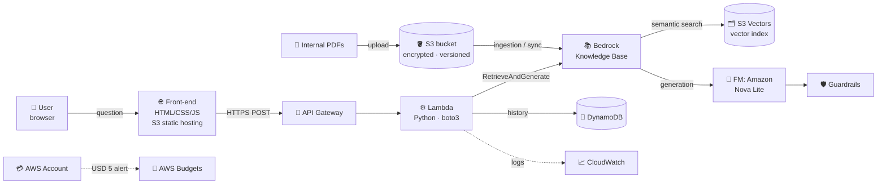
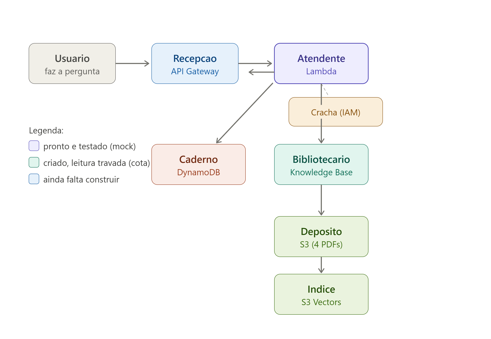

# 🏛️ Architecture
> **Note:** This document describes the *target* architecture (design intent). For the current build status of each component — e.g. **Guardrails (planned)**, and ingestion **awaiting account quota** — see the [project phases in the README](../README.md#-project-phases).

## Diagram

### Visual analogy

For an intuitive view, the system maps to a library:

## Request flow

1. **Documents enter the system** — HR PDFs are uploaded to a private S3 bucket (SSE-S3 encryption, versioning, Block Public Access on)
2. **Ingestion** — the Bedrock Knowledge Base fetches the documents, splits them into chunks, generates embeddings with Titan Text Embeddings, and stores them in an **S3 Vectors** index
3. **User asks a question** — the static front-end sends an HTTPS POST to API Gateway
4. **Context retrieval** — Lambda calls the Bedrock `RetrieveAndGenerate` API; the Knowledge Base performs **semantic search** over the vector index and returns the most relevant chunks
5. **Answer generation** — the foundation model (Amazon Nova Lite) generates an answer grounded in the retrieved chunks; **Guardrails** filter the output
6. **Response** — the answer returns to the user **with source citations**; the exchange is stored in DynamoDB
7. **Observability & governance** — every step is logged in CloudWatch; management actions are audited by CloudTrail; AWS Budgets caps the project at USD 5 with layered alerts

## Layer summary

| Layer | Service(s) | Role |
|---|---|---|
| Presentation | S3 static hosting | Web UI |
| API | API Gateway | HTTPS entry point |
| Compute | Lambda (Python) | Orchestration |
| GenAI | Bedrock KB + Nova Lite + Guardrails | RAG pipeline |
| Vector store | S3 Vectors | Low-cost embeddings index |
| Data | S3 (documents) · DynamoDB (history) | Storage |
| Observability | CloudWatch · CloudTrail | Logs, metrics, audit |
| Governance | AWS Budgets · cost tags | Cost control |
